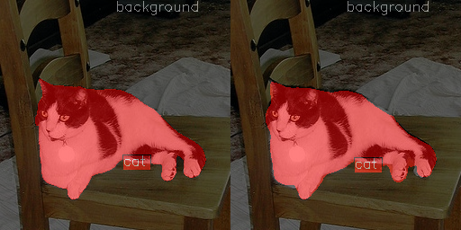
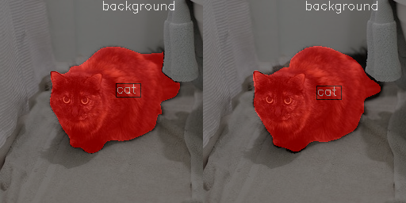
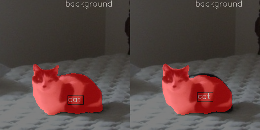
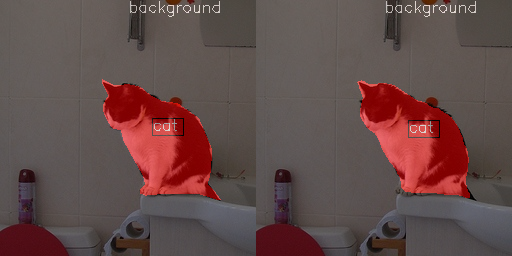
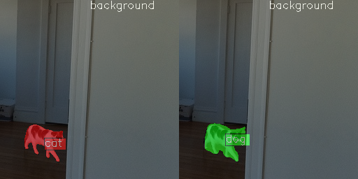
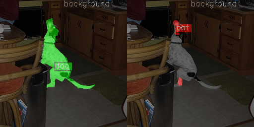
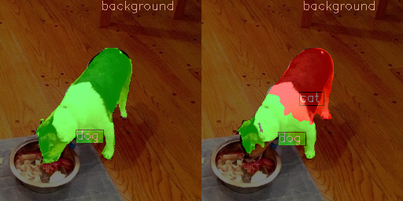

# Multi-class Semantic Segmentation Model Selection and Training with mmsegmentation
Target metric: mDice score. The project is considered complete with mDice > 0.75.

## Phase 1. Exploratory Data Analysis (EDA)

### Data Quality Analysis 
The original dataset was checked for images without corresponding labels using the `dataset.eda.missed_labels` script. No annotation errors (missing masks) were found. 
The dataset format was converted to COCO to standardize formatting with `mmsegmentation`.

### EDA
Class distribution analysis (in pixels):
- Background: 11908826 pixels
- Cat: 653268 pixels
- Dog: 545106 pixels
There is a strong class imbalance towards the background.

Average image size: 256x256. The dataset contains only images of this size (min=256x256, max=256x256).

[Jupyter Notebook with EDA](practicum_work/notebook.ipynb) is included in the repository.

## Phase 2. Initial Hypotheses

### Initial Hypothesis 1: DeepLabV3+ with ResNet-50 (d8)

**Training Results**  
- [Config](configs/experiments/deeplabv3plus_r50_d8_20k_coco_animals.py)
- [ClearML Logs](https://app.clear.ml/projects/ef8fb423fbc040078cf0a46d46db7a45/experiments/a1b7ce551b7c4223844b2ca5a68742c0/output/log)

**Quality Analysis**  
Metrics on the test subset:

| Class | mIoU | mAcc | mDice |
|---|---|---|---|
| background | 97.37 | 98.96 | 98.67 |
| cat | 75.91 | 86.68 | 86.31 |
| dog | 69.52 | 76.24 | 82.02 |
| **All** | **80.94** | **87.29** | **89.00** |

The model shows good metrics, but there are difficulties with segmenting dogs (mDice = 82.02).

### Initial Hypothesis 2: DeepLabV3+ with ResNet-50 (d16)

**Training Results**  
- [Config](configs/experiments/deeplabv3plus_r50_d16_20k_coco_animals.py)
- [ClearML Logs](https://app.clear.ml/projects/ef8fb423fbc040078cf0a46d46db7a45/experiments/0d4a3cf7c7da49e48ea14aea41c580f6/output/log)

**Quality Analysis**  
Metrics on the test subset:

| Class | mIoU | mAcc | mDice |
|---|---|---|---|
| background | 97.01 | 98.83 | 98.48 |
| cat | 74.97 | 83.24 | 85.70 |
| dog | 66.84 | 77.63 | 80.12 |
| **All** | **79.61** | **86.57** | **88.10** |

Increasing the dilation to `d16` on ResNet-50 slightly deteriorated the model's result (mDice decreased to 88.10), and objects began to be recognized slightly worse.

## Phase 3. Quality Improvement Experiments

### Experiment 1: Architectural Complexity (ResNet-101)

**Training Results**
- [Config](configs/experiments/deeplabv3plus_r101_d16_20k_coco_animals.py)
- [ClearML Logs](https://app.clear.ml/projects/ef8fb423fbc040078cf0a46d46db7a45/experiments/7aef4d0b58ff45339bafa439d126197b/output/log) 

**Quality Analysis**
Metrics on the test subset:

| Class | mIoU | mAcc | mDice |
|---|---|---|---|
| background | 97.26 | 98.96 | 98.61 |
| cat | 76.28 | 86.19 | 86.55 |
| dog | 66.56 | 74.47 | 79.93 |
| **All** | **80.04** | **86.54** | **88.36** |

Increasing the architectural complexity to ResNet-101 gave a slight improvement compared to ResNet-50 with dilation=16. However, the overall mDice result is still worse than the baseline (ResNet-50, d=8) (88.36 vs 89.00).

## Phase 4. Conclusion and Best Experiment Selection

### Best Experiment 
The best experiment by the mDice metric: **Initial Hypothesis 1 (DeepLabV3+, ResNet-50, d=8)**.
It turned out that for this task and the selected image size (256x256), a complex backbone (ResNet-101) and a large receptive field (d16) were unnecessary. As a result, the most basic and lightweight configuration worked best and generalized perfectly on the test set.

**mDice (test subset) = 89.00**  
[ClearML Logs](https://app.clear.ml/projects/ef8fb423fbc040078cf0a46d46db7a45/experiments/a1b7ce551b7c4223844b2ca5a68742c0/output/log)

### Correct Prediction Examples (Test Dataset)
Selected images with the best individual mDice score (sorted by script):  
  
  
  
  

### Error Examples (Test Dataset)
Selected images with the worst individual mDice score:  
  
  
  
  

## Phase 5. Code Documentation

```text
.
├── configs
│   ├── _base_
│   │   ├── datasets
│   │   │   └── coco_animals.py - Basic config for the COCOAnimalsDataset
│   │   └── models
│   │       ├── deeplabv3plus_r50-d8.py - Basic model config for ResNet-50 d8
│   │       ├── deeplabv3plus_r50-d16.py - Basic model config for ResNet-50 d16
│   │       └── deeplabv3plus_r101-d16.py - Basic model config for ResNet-101 d16
│   └── experiments - Directory with runnable configs for all experiments
├── mmseg
│   └── datasets
│       ├── __init__.py - Registration for COCOAnimalsDataset
│       └── coco_animals.py - COCOAnimalsDataset class
└── practicum_work
    ├── src
    │   ├── dataset
    │   │   ├── coco.py - Dataset generation in COCO format
    │   │   ├── eda.py - Generation of EDA metrics, class & size distributions
    │   │   └── label.py - Script for superimposing colored masks on dataset images
    │   └── analysis 
    │       ├── dump_model_predictions.py - Script for batch inference and saving model predictions
    │       └── save_best_on_worst_based_on_individual_dice_score.py - Script to calculate mDice and select best/worst examples for visualization
```

# Repository
[https://github.com/IGORSVOLOHOVS/mmsegmentation-benchmarking](https://github.com/IGORSVOLOHOVS/mmsegmentation-benchmarking)
